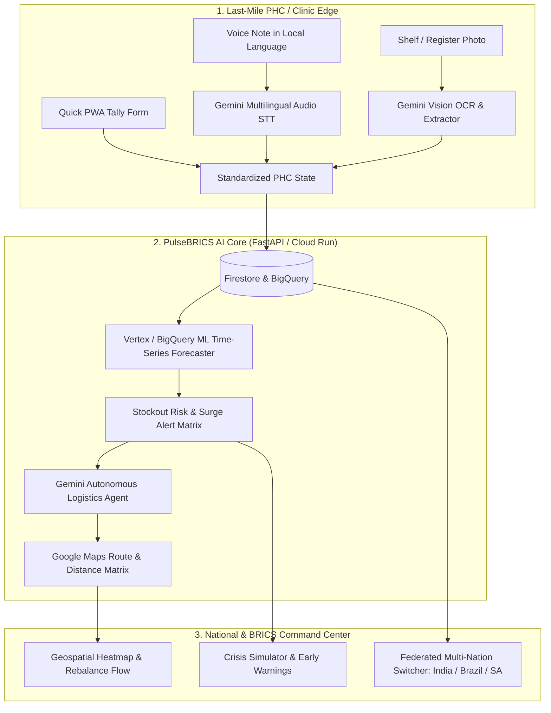

# Implementation Plan - PulseBRICS: Federated AI Health Supply Chain & Resilience Mesh

Building an end-to-end, production-ready, interactive digital public infrastructure platform for **Track 03: Smart Health & Supply Chain Resilience (BRICS Theme: Resilience)** in the Google Cloud Hackathon 2026.

---

## 1. Problem Statement & Strategic Assessment

### The Core Problem
Public healthcare systems across emerging economies (India, Brazil, South Africa, etc.) suffer from critical supply chain fragmentation:
- **Last-Mile Data Blindspot:** Rural Primary Health Centres (PHCs / UBSs) rely on physical logbooks and paper registers, leading to delayed or inaccurate reporting.
- **Unpredicted Stock-Outs:** Critical medicines (antivenom, insulin, oxytocin, pediatric antibiotics) run out during localized disease outbreaks, monsoon surges, or disaster events without advance warning.
- **High Expiry & Wastage:** While PHC $A$ suffers a stockout, neighbouring PHC $B$ (18 km away) has expiring stock that goes to waste due to siloed district communication.
- **Lack of Cross-Border Early Intelligence:** Pandemics and vector-borne surges (e.g., Dengue strains, Respiratory illness waves) hit BRICS regions in predictable seasonal waves, but health ministries lack a shared, privacy-preserving predictive pipeline.

### Why This Solution Wins 1st Place
PulseBRICS bridges the last-mile clinic to national and cross-border ministries via 4 synchronized layers:
1. **Zero-Friction Multimodal Edge Logging:** Multilingual voice notes (Hindi, Portuguese, Russian, Zulu, English) & shelf/register photos parsed directly via **Gemini 2.0 / 1.5 Multimodal AI**.
2. **Predictive Outbreak & Stock-Out Engine:** Time-series demand forecasting & early warning models factoring in climate signals (monsoon/flood alerts), historical footfalls, and regional disease trends.
3. **Autonomous Logistics Rebalancer (Gemini Agent + Google Maps):** Automated cross-district transfer recommendations with route calculation, cold-chain constraint checks, and expiry-first batch matching.
4. **Interactive Crisis Simulation & BRICS Federated Node:** Real-time geospatial crisis injection (e.g., "Simulate Flood / Dengue Wave in District") showing instant dynamic redistribution and multi-country health dashboard switching.

---

## 2. User Review Required

> [!IMPORTANT]
> **Primary Technology Stack Selection:**
> - **Frontend Web App:** React + Vite + TailwindCSS + Lucide Icons + Recharts + Leaflet/Google Maps Platform SDK (ultra-responsive, premium glassmorphic dark/light UI with interactive crisis simulator).
> - **Backend & AI Service:** Python FastAPI / Node.js backend hosting Gemini Multimodal extraction, Agent Function Calling, and Predictive Time-Series simulation endpoints.
> - **Data & Cloud Storage:** Firebase / Firestore schema for real-time live synchronization + BigQuery simulation dataset for PHC records across India, Brazil, and South Africa.

> [!NOTE]
> All code will run locally with instant mock data fallbacks and live Gemini API key connectivity, allowing zero-friction local development, instant deployment to Cloud Run / Vercel, and presentation readiness.

---

## 3. Architecture & System Flow

---

## 4. Proposed Changes & Implementation Phases

### Phase 1: Project Initialization & Foundation Setup
- Scaffold a clean, modular modern web application in the project root:
  - **`frontend/`**: Vite + React + Tailwind CSS with high-end glassmorphism, Lucide icons, interactive maps, Recharts visualizer.
  - **`backend/`**: FastAPI server with modular routes for Gemini Multimodal processing, Agent Rebalancing, Time-Series forecasting, and BRICS dataset management.
  - **`data/`**: Comprehensive realistic datasets covering 50+ PHCs across districts in India (e.g., Maharashtra/Kerala), Brazil (São Paulo/Bahia), and South Africa (Gauteng/KwaZulu-Natal).

#### [NEW] [package.json](file:///c:/Users/hp/Desktop/Hackthon/package.json)
#### [NEW] [frontend/](file:///c:/Users/hp/Desktop/Hackthon/frontend)
#### [NEW] [backend/](file:///c:/Users/hp/Desktop/Hackthon/backend)

---

### Phase 2: Multimodal Last-Mile PHC Logger (Gemini 2.0 / 1.5 API)
- **Voice Ingestion Endpoint:** Accepts recorded voice notes in Hindi, Portuguese, or English. Prompts Gemini to parse spoken inventory numbers into structured JSON updates (`{medicine: "Anti-Venom", stock: 12, consumed: 8, unit: "vials"}`).
- **Shelf & Prescription Vision Scanner:** Accepts medicine box/shelf photos or handwritten stock ledger snapshots. Gemini extracts medicine name, batch number, current count, and expiry date.
- **Offline/Low-Bandwidth Sync:** LocalStorage caching layer for remote clinics with intermittent internet connectivity.

#### [NEW] [backend/services/gemini_service.py](file:///c:/Users/hp/Desktop/Hackthon/backend/services/gemini_service.py)
#### [NEW] [frontend/src/components/PHCLogger/VoiceLogModal.jsx](file:///c:/Users/hp/Desktop/Hackthon/frontend/src/components/PHCLogger/VoiceLogModal.jsx)
#### [NEW] [frontend/src/components/PHCLogger/VisionScanModal.jsx](file:///c:/Users/hp/Desktop/Hackthon/frontend/src/components/PHCLogger/VisionScanModal.jsx)

---

### Phase 3: Predictive Stockout & Epidemic Surge Engine
- **Time-Series Demand Model:** Calculates 7-day, 14-day, and 30-day stock depletion projections based on moving average consumption, disease seasonality, and footfall acceleration.
- **Climate & Outbreak Factor Injection:** Ingests external triggers (monsoon flood alert, high temperature vector index) that multiply demand for specific categories (ORS, Doxycycline, Snake Antivenom, IV fluids).
- **Vulnerability Scoring:** Assigns each PHC a real-time Health Resilience Score ($0-100\%$) and classifies risk into `NORMAL`, `WATCH`, `CRITICAL_SURGE`, or `STOCKOUT_IMMINENT`.

#### [NEW] [backend/services/predictive_engine.py](file:///c:/Users/hp/Desktop/Hackthon/backend/services/predictive_engine.py)
#### [NEW] [frontend/src/components/Analytics/PredictiveChart.jsx](file:///c:/Users/hp/Desktop/Hackthon/frontend/src/components/Analytics/PredictiveChart.jsx)

---

### Phase 4: Autonomous Rebalancer Agent (Gemini Function Calling + Google Maps)
- **Agentic Multi-Echelon Rebalancer:**
  - Evaluates supply deficit at Clinic $A$.
  - Queries donor clinics within optimal radius with surplus stock expiring within $30-60$ days (First-to-Expire, First-Out policy).
  - Uses Google Maps Platform (Distance & Direction Matrix) to generate optimal dispatch corridors, ETA, cold-chain safety windows, and fuel/carbon metrics.
  - Returns structured dispatch manifests ready for 1-click administrative approval.

#### [NEW] [backend/services/agent_rebalancer.py](file:///c:/Users/hp/Desktop/Hackthon/backend/services/agent_rebalancer.py)
#### [NEW] [frontend/src/components/Logistics/RebalanceModal.jsx](file:///c:/Users/hp/Desktop/Hackthon/frontend/src/components/Logistics/RebalanceModal.jsx)

---

### Phase 5: National Command Center UI & "Crisis Simulation Mode"
- **Interactive Geospatial Visualizer:**
  - Real-time map displaying all PHC nodes color-coded by stockout vulnerability.
  - Interactive dispatch lines showing real-time rebalancing transfers.
- **Crisis Simulation Mode (The "Wow" Demo Feature):**
  - Slider/toggle allowing judges to trigger a simulated disaster: *"Monsoon Flood in Kolhapur District"* or *"Dengue Outbreak in Campinas, Brazil"*.
  - Watch the UI dynamically simulate stock plunge, trigger early warning sirens, and let the Gemini Agent immediately propose an emergency multi-depot rerouting strategy.
- **Cross-Border BRICS Federation Hub:**
  - Country selector (India 🇮🇳, Brazil 🇧🇷, South Africa 🇿🇦).
  - Demonstrates privacy-safe cross-border epidemiological intelligence sharing (e.g., vaccine batch efficacy, seasonal respiratory trends).

#### [NEW] [frontend/src/components/Dashboard/CommandCenter.jsx](file:///c:/Users/hp/Desktop/Hackthon/frontend/src/components/Dashboard/CommandCenter.jsx)
#### [NEW] [frontend/src/components/Map/HealthGeoMap.jsx](file:///c:/Users/hp/Desktop/Hackthon/frontend/src/components/Map/HealthGeoMap.jsx)
#### [NEW] [frontend/src/components/Simulation/CrisisSimulator.jsx](file:///c:/Users/hp/Desktop/Hackthon/frontend/src/components/Simulation/CrisisSimulator.jsx)

---

### Phase 6: Polish, Documentation & Hackathon Deliverables
- **Pitch Deck Template & Content (10-12 Slides):** Markdown/PDF-ready pitch outline covering Problem, Solution, Tech Architecture, Google AI tools, BRICS scalability, and Policy Deployment roadmap.
- **Demo Script (3-5 mins):** Step-by-step walkthrough for recording the winning submission video.
- **README & Deployment Guide:** Comprehensive documentation with architecture diagrams, API specs, and Cloud Run / Vercel deployment commands.

#### [NEW] [docs/PITCH_DECK.md](file:///c:/Users/hp/Desktop/Hackthon/docs/PITCH_DECK.md)
#### [NEW] [docs/DEMO_VIDEO_SCRIPT.md](file:///c:/Users/hp/Desktop/Hackthon/docs/DEMO_VIDEO_SCRIPT.md)
#### [NEW] [README.md](file:///c:/Users/hp/Desktop/Hackthon/README.md)

---

## 5. Verification & Testing Plan

### Automated Verification
- **Backend API Tests:** Verify all endpoints (`/api/phc/list`, `/api/ai/voice-parse`, `/api/ai/vision-scan`, `/api/predict/forecast`, `/api/agent/rebalance`) return status `200` with valid JSON schemas.
- **Frontend Build & Lint:** Ensure `npm run build` generates error-free production bundles.

### Manual Verification Flows
1. **Voice Input Flow:** Record / simulate audio of a rural nurse speaking in Hindi/English $\rightarrow$ verify accurate extraction into the medicine inventory table.
2. **Vision Scanning Flow:** Upload mock medicine shelf/ledger photos $\rightarrow$ verify OCR parsing and batch date recognition.
3. **Crisis Simulation Flow:** Trigger "Monsoon Flood Alert" $\rightarrow$ verify stock depletion forecast changes and Gemini Agent generates instant redistribution manifests.
4. **Cross-Border Switcher:** Toggle between India, Brazil, and South Africa $\rightarrow$ verify localized data, currency, and language support.

---

## 6. Open Questions & Alignment
- Are there specific Indian states or BRICS country pairs you'd like highlighted first in the demo (e.g., India + Brazil + South Africa)?
- Do you have a Gemini API key ready for testing live multimodal inferences, or should we also bundle realistic offline AI mock fallbacks so the app runs smoothly in all environments? (We will build both).
